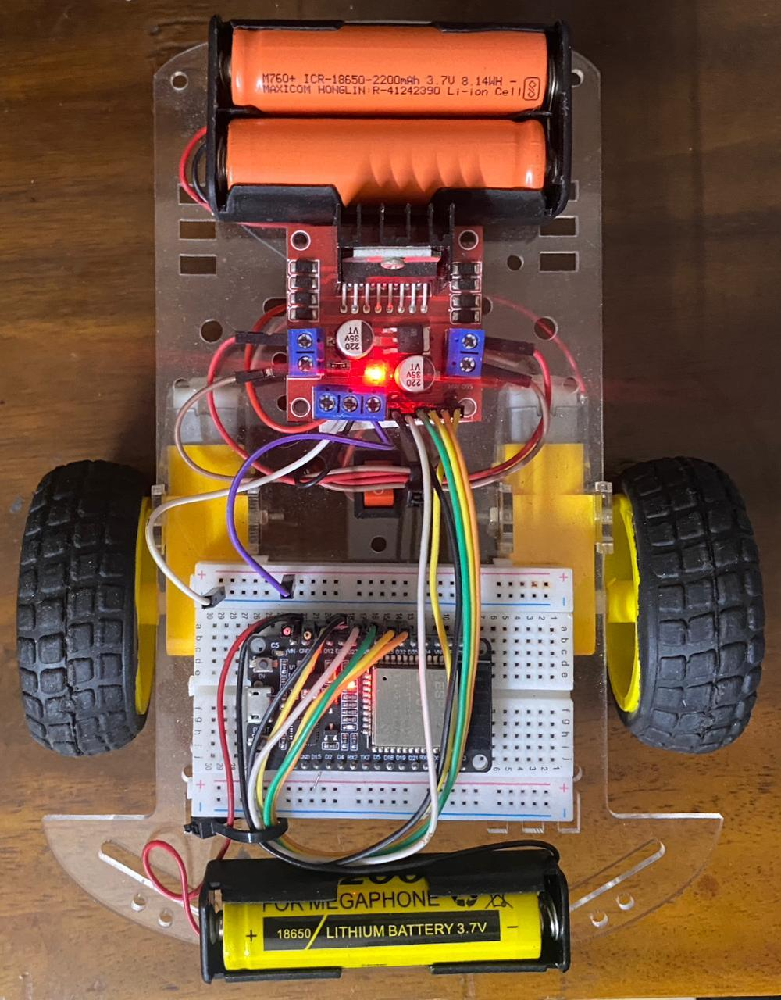
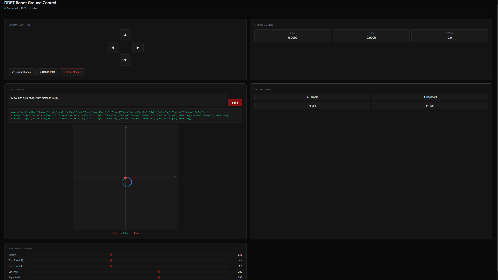

# DDRT - Differential Drive Robot V1 — Open-Loop LLM Robotics Controller

[](https://python.org)
[](https://www.arduino.cc/)
[](https://flask.palletsprojects.com/)
[](https://ai.google.dev/)
[](LICENSE)

> **A fully integrated, three-tier robotics system that lets you control a differential drive robot using natural language or a live web dashboard — with an LLM-to-hardware execution pipeline and real-time odometry.**

---

## Demo

> *e.g., "Move Like ciricle shape with distance 80cm"*
(docs/demo.gif) 

| Robot Hardware | Ground Control Station |
|:-:|:-:|
|  |  |

---

## Table of Contents

- [Project Overview](#project-overview)
- [System Architecture](#system-architecture)
- [Hardware Requirements](#hardware-requirements)
- [Software Stack](#software-stack)
- [Repository Structure](#repository-structure)
- [Setup & Installation](#setup--installation)
- [Calibration Guide](#calibration-guide)
- [API Reference](#api-reference)
- [Engineering Highlights](#engineering-highlights)
- [Known Limitations](#known-limitations)
- [Roadmap — V2](#roadmap--v2)
- [License](#license)

---

## Project Overview

**DDRT - Differential Drive Robot V1** is a three-tier robotics system built as a fully working proof-of-concept for LLM-to-hardware control pipelines. It allows:

- **Manual control** from any browser on the same network — including mobile — via a D-pad dashboard
- **Natural language commands** like *"Drive in a 30 cm square"* which are parsed by Gemini into a structured JSON motion plan and executed step-by-step on real hardware
- **Live telemetry** — X, Y, Theta odometry streamed from the ESP32 at 1.5 Hz
- **Real-time spatial map** — canvas radar rendering the robot's traversed path
- **Live hardware tuning** without reflashing — PWM, velocity, and turn speeds can be adjusted via sliders mid-session

The core technical achievement is a highly optimized **open-loop dead reckoning** system with software workarounds for real-world hardware asymmetries.

---

## System Architecture

```
┌─────────────────────────────────────────────────────────┐
│                     Tier 3: GCS Dashboard               │
│              HTML / CSS / JS  (Any browser)             │
│  D-pad control │ LLM mode │ Canvas map │ Tuning sliders │
└──────────────────────┬──────────────────────────────────┘
                       │ HTTP REST (port 5000)
                       ▼
┌─────────────────────────────────────────────────────────┐
│                  Tier 2: Flask Brain                    │
│              Python 3 / Flask  (Laptop, port 5000)      │
│  Gemini API │ execute_plan() │ Odometry │ /command      │
└──────────────────────┬──────────────────────────────────┘
                       │ HTTP (port 80)
                       ▼
┌─────────────────────────────────────────────────────────┐
│               Tier 1: ESP32 Firmware                    │
│            C++ / Arduino  (ESP32, port 80)              │
│  Motor control │ Dead reckoning │ /tune │ Return paths  │
└─────────────────────────────────────────────────────────┘
                       │
                       ▼
              ┌────────────────┐
              │  L298N + Motors│
              │  Physical robot│
              └────────────────┘
```

### LLM Command Flow

```
User types "Drive a 30cm square"
        │
        ▼
Flask /command (POST)
        │
        ▼
Gemini 2.5 Flash ──► JSON plan generated
        │             [{"action":"forward","value":0.3},
        │              {"action":"right","value":90}, ...]
        ▼
Value clamping (0.01–2.0 m, 1–360°)
        │
        ▼
execute_plan() loop — blocking HTTP per step
        │
        ├── /moveExact?action=forward&distance=30
        │       └── HTTP 200 → odometry updated
        ├── /turnExact?direction=right&angle=90
        │       └── HTTP 200 → theta updated
        └── (repeat for each step)
```

---

## Hardware Requirements

| Component | Details |
|-----------|---------|
| Microcontroller | ESP32 (any variant with Wi-Fi) |
| Motor driver | L298N dual H-bridge |
| Motors | 2× DC gear motors (ideally matched RPM, but asymmetry is handled in software) |
| Chassis | 2-wheel differential drive + passive rear caster |
| Power | 7.4 V LiPo or 2×18650 for motors; 5 V USB for ESP32 |
| Camera (optional, V2) | Overhead webcam — not used in V1 |

### Wiring Diagram

> 📸 *See `docs/wiring.png` for the full wiring close-up*

| ESP32 Pin | L298N |
|-----------|-------|
| GPIO 26 (IN1) | Motor A direction 1 |
| GPIO 27 (IN2) | Motor A direction 2 |
| GPIO 32 (IN3) | Motor B direction 1 |
| GPIO 33 (IN4) | Motor B direction 2 |
| GPIO 12 (ENA) | Motor A PWM enable |
| GPIO 13 (ENB) | Motor B PWM enable |

---

## Software Stack

| Layer | Technology |
|-------|-----------|
| Firmware | C++ / Arduino framework on ESP32 |
| Backend | Python 3.10+, Flask, Flask-CORS |
| LLM | Google Gemini 2.5 Flash via `google-genai` SDK |
| Frontend | Vanilla HTML5, CSS3, JavaScript (no frameworks) |
| Communication | HTTP REST (ESP32 ↔ Flask ↔ Browser) |

---

## Repository Structure

```
DDRT - Differential Drive Robot V1/
├── firmware/
│   └── gemini_given.ino       # ESP32 firmware — motor control, odometry, HTTP server
├── backend/
│   ├── llm_bridge_gem2.py     # Flask bridge — Gemini API, execute_plan, odometry
│   └── requirements.txt       # Python dependencies
├── frontend/
│   └── index.html             # GCS dashboard — D-pad, LLM mode, canvas map
├── docs/
│   ├── robot.jpg              # Physical robot photo
│   ├── wiring.png             # Hardware wiring diagram / close-up
│   ├── dashboard.png          # GCS dashboard screenshot
│   └── demo.gif               # Robot executing a command (optional but recommended)
├── .gitignore
└── README.md
```

---

## Setup & Installation

### 1. Flash the ESP32

1. Open `firmware/gemini_given.ino` in the Arduino IDE.
2. Install board support: **ESP32 by Espressif** via Boards Manager.
3. Update Wi-Fi credentials:
   ```cpp
   const char* WIFI_SSID     = "YOUR_SSID";
   const char* WIFI_PASSWORD = "YOUR_PASSWORD";
   ```
4. Flash to your ESP32. Open the Serial Monitor (115200 baud) and note the assigned IP address.
5. Update `ESP_IP` in both `backend/llm_bridge_gem2.py` and `frontend/index.html` with that IP.

### 2. Set Up the Python Backend

```bash
cd backend
pip install -r requirements.txt
```

Set your Gemini API key as an environment variable (get one free at [ai.google.dev](https://ai.google.dev)):

```bash
# Linux / macOS
export GEMINI_API_KEY="your_key_here"

# Windows
set GEMINI_API_KEY=your_key_here
```

Start the Flask server:

```bash
python llm_bridge_gem2.py
```

### 3. Open the Dashboard

Open `frontend/index.html` in any browser on the same Wi-Fi network. On mobile, navigate to `http://<your-laptop-ip>:5000` if you want LLM mode on your phone.

> The status indicator (top right) will turn green when both Flask and the ESP32 are reachable.

---

## Calibration Guide

Open-loop control requires accurate physical constants. Calibrate in this order:

**Step 1 — Straight-line velocity**
Click "Calibrate Straight" in the dashboard. The robot drives for 3 seconds. Measure the distance in metres, divide by 3.
```cpp
float velocity = 0.266;   // replace with your measured value (m/s)
```

**Step 2 — Left turn speed**
Click "Calibrate Left". Robot spins for 3 seconds. Measure degrees rotated, convert to radians, divide by 3.
```cpp
float turn_speed_left = 2.2;   // rad/s
```

**Step 3 — Right turn speed**
Same as Step 2 but for the right direction. Calibrate **independently** — hardware asymmetry means these differ.
```cpp
float turn_speed_right = 2.2;  // rad/s — calibrate separately!
```

**Step 4 — PWM balance**
If the robot drifts during straight-line moves, adjust `pwmLeft` / `pwmRight` via the dashboard sliders until it tracks straight. Hardcode the final values back into the firmware globals.

---

## API Reference

### ESP32 Endpoints (Port 80)

| Endpoint | Method | Parameters | Description |
|----------|--------|-----------|-------------|
| `/move` | GET | `action` = forward \| backward \| left \| right | Continuous move (manual) |
| `/stop` | GET | — | Stop with active braking |
| `/moveExact` | GET | `action`, `distance` (cm) | LLM mode — timed straight move |
| `/turnExact` | GET | `direction`, `angle` (deg) | LLM mode — timed rotation |
| `/position` | GET | — | Returns `{x, y, theta, mission}` JSON |
| `/return` | GET | — | Return via shortest path (trig) |
| `/returnPath` | GET | — | Return by retracing recorded history |
| `/tune` | GET | `pwmLeft`, `pwmRight`, `velocity`, `turnL`, `turnR`, `brake` | Live RAM parameter injection |
| `/clearMemory` | GET | — | Reset odometry and move history |
| `/calibrate/straight` | GET | — | 3-second calibration run |
| `/calibrate/turn_left` | GET | — | 3-second left spin |
| `/calibrate/turn_right` | GET | — | 3-second right spin |

### Flask Endpoints (Port 5000)

| Endpoint | Method | Body | Description |
|----------|--------|------|-------------|
| `/command` | POST | `{"text": "..."}` | Natural language → execute |
| `/path` | GET | — | Path history array for canvas map |
| `/reset` | GET/POST | — | Clear Python odometry |
| `/status` | GET | — | Health check — ESP32 reachability |

---

## Engineering Highlights

### Direction-Aware Active Braking
Standard motor cutoffs allow the robot to coast after a timed move, overshooting the target. A ~30 ms counter-pulse is applied in the exact opposite direction before full power cut, killing kinetic energy instantly.

```cpp
// currentAction is set BEFORE the motor starts, so brake always opposes correctly
if (currentAction == "forward") {
    digitalWrite(IN1, LOW);  digitalWrite(IN2, HIGH);   // backward pulse
    digitalWrite(IN3, LOW);  digitalWrite(IN4, HIGH);
}
delay(brakeDelay);
// Full stop
```

### Independent Turn Calibration
Hardware motor asymmetry and caster drag cause different angular rates for left vs right turns. `turn_speed_left` and `turn_speed_right` are decoupled and calibrated independently.

### Brake Compensation Factor
The robot continues to move slightly during the brake pulse itself. `BRAKE_COMP_FACTOR = 0.6` shortens the drive duration by 60% of `brakeDelay` milliseconds, preventing systematic overshoot in exact-distance moves.

### Odometry-Gated Path Updates
Python-side odometry is only updated if the ESP32 returns HTTP 200. On network errors or ESP32 rejections, the path history is not updated — preventing phantom position drift from failed commands.

### Live Parameter Injection via `/tune`
All physics constants (`velocity`, `turn_speed_left`, `turn_speed_right`, `pwmLeft`, `pwmRight`, `brakeDelay`) live in ESP32 global RAM. The `/tune` endpoint overwrites them in-place, enabling real-time calibration without reflashing the firmware.

---

## Known Limitations

This system hits the physical ceiling of open-loop control:

- **Cumulative drift** — Wheel slip, voltage sag, and floor friction cause errors that compound across steps. A 2° heading error on step 1 becomes ~20° off on step 10.
- **No feedback** — The ESP32 has no sensors to detect or correct deviation from the planned path.
- **Battery sensitivity** — As the battery drains, motor speed drops, invalidating the calibrated `velocity` constant mid-session.

These are fundamental limits of the dead-reckoning approach, not bugs.

---

## Roadmap — V2

V2 abandons dead reckoning entirely in favour of a **closed-loop overhead vision system**:

- **Overhead webcam** mounted above the workspace
- **ArUco marker** on the robot for 6-DoF pose estimation via OpenCV
- **Python PID controller** — heading error feedback loop replaces open-loop time estimation
- **Modular architecture** — 13-file structure across config, core, planning, server, and calibration layers
- **Vision-assisted path correction** — active during LLM commands and straight-line moves

> V2 implementation in progress in a separate repository.

---

## License

This project is licensed under the MIT License. See [LICENSE](LICENSE) for details.

---

*Built by [Noel](https://github.com/FireMax-Bot) — BTech Robotics & Automation, Toc H Institute of Science & Technology (TIST)*
